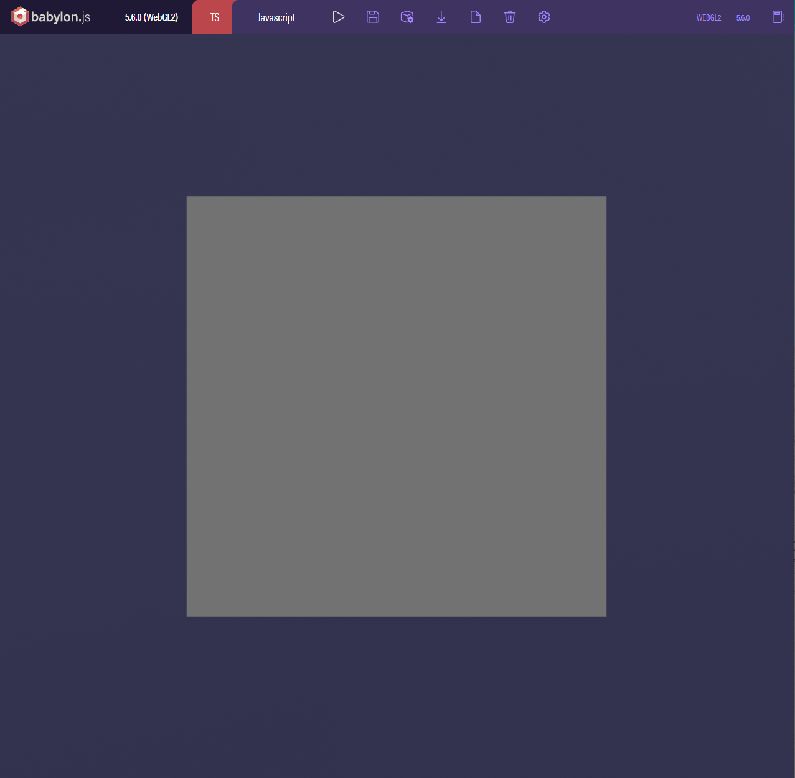
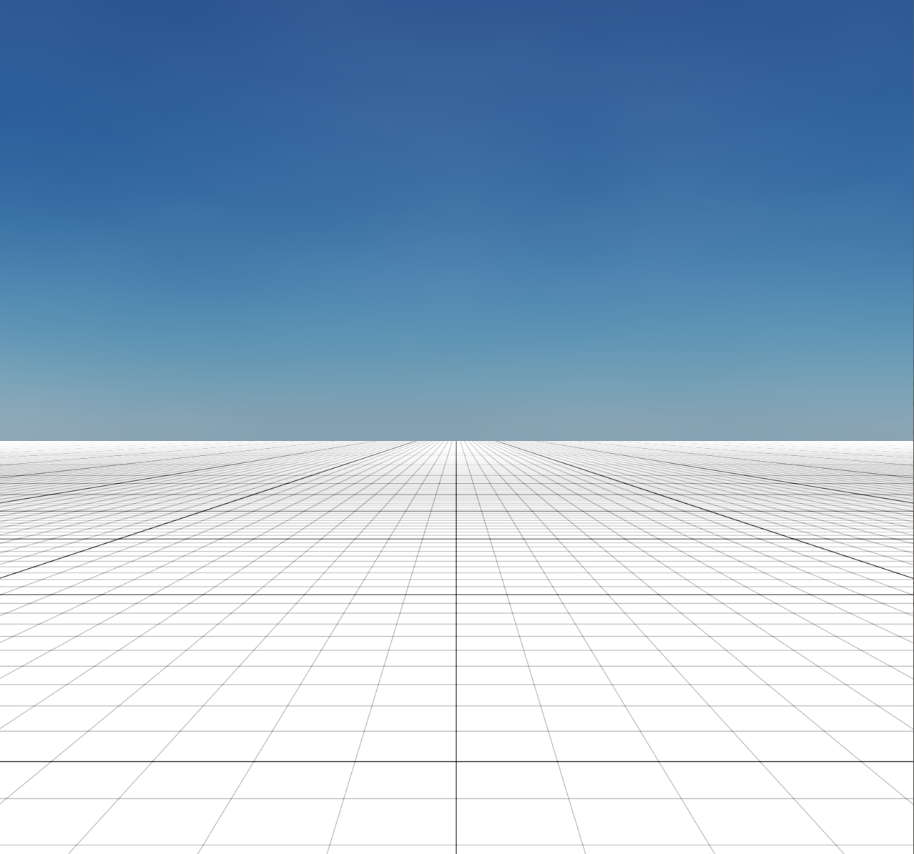

# babylon-capylabs-default-environment

Better expensive default environment

As-is



- see [Scene | Babylon.js Documentation](https://doc.babylonjs.com/divingDeeper/scene/fastBuildWorld)

To-be



## Features

- One primary [DirectionalLight](https://doc.babylonjs.com/divingDeeper/lights/lights_introduction#the-directional-light) for shadow
- [SkyMaterial](https://doc.babylonjs.com/toolsAndResources/assetLibraries/materialsLibrary/skyMat)
- ground plane with [GridMaterial](https://doc.babylonjs.com/toolsAndResources/assetLibraries/materialsLibrary/gridMat)
- FPS-style [FreeCamera](https://doc.babylonjs.com/typedoc/classes/babylon.freecamera)
- [SSAO](https://doc.babylonjs.com/divingDeeper/postProcesses/SSAORenderPipeline)
- [Shadow](https://doc.babylonjs.com/divingDeeper/lights/shadows) or [CascadedShadow](https://doc.babylonjs.com/divingDeeper/lights/shadows_csm)

## Installation

### on npm

```bash
$ npm install --save babylon-capylabs-default-environment
```

### on [playground](https://playground.babylonjs.com/)

```js
const loadScript = async (url) => {
    const script = document.createElement('script');
    script.src = url;
    document.body.appendChild(script);
    return new Promise((resolve, reject) => {
        script.onload = resolve;
        script.onerror = reject;
    });
}

const createScene = async () => {
    const scene = new BABYLON.Scene(engine);
    await loadScript("FIXME");
}
```

## Usage

```js
// FIXME
```

## Contributing

## License

Distributed under the Apache-2.0 License. See `LICENSE` for more information.
